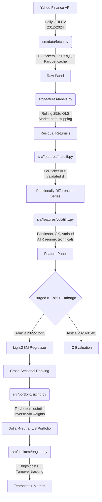

# Cross-Sectional Equity Forecasting & Friction-Adjusted Long/Short Backtest

<p align="center">
  <a href="https://github.com/Manthan-Sagar/StockAnalysis"></a>
  <a href="https://www.python.org/"></a>
  <a href="https://lightgbm.readthedocs.io/"></a>
  <a href="https://scikit-learn.org/"></a>
  <a href="https://pytest.org/"></a>
  <a href="https://opensource.org/licenses/MIT"></a>
</p>

> **An institutional-style quantitative research pipeline** for predicting cross-sectional residual returns across ~100 liquid US equities, validating with leakage-safe purged cross-validation, constructing a dollar-neutral long/short portfolio with volatility-parity sizing, and backtesting with realistic transaction costs.
>
> The deliverable is a **research framework whose rigor is the selling point** — a modest, honest Sharpe ratio from a correct methodology is a better resume asset than an impressive one you can't defend in an interview.

---

## Table of Contents
- [Methodology](#methodology)
- [Universe Construction & Survivorship Bias](#universe-construction--survivorship-bias)
- [Labeling: Residual Returns](#labeling-residual-returns)
- [Feature Engineering](#feature-engineering)
- [Validation: Purged K-Fold with Embargo](#validation-purged-k-fold-with-embargo)
- [Model: LightGBM](#model-lightgbm)
- [Portfolio Construction](#portfolio-construction)
- [Backtest & Cost Model](#backtest--cost-model)
- [Results](#results)
- [Repository Structure](#repository-structure)
- [Quickstart](#quickstart)
- [Testing](#testing)
- [Docker](#docker)
- [Caveats & Limitations](#caveats--limitations)
- [License & Author](#license--author)

---

## Methodology

This pipeline implements a research-grade quantitative workflow:



---

## Universe Construction & Survivorship Bias

**Approach (pragmatic)**: ~100 currently-listed liquid large/mid-cap US equities across 11 GICS sectors for the period 2012–2024.

| Sector | Count | Examples |
|---|---|---|
| Technology | 20 | AAPL, MSFT, GOOGL, NVDA, ADBE... |
| Healthcare | 12 | JNJ, UNH, PFE, LLY, AMGN... |
| Financials | 12 | JPM, BAC, GS, BLK, AXP... |
| Consumer Discretionary | 10 | AMZN, TSLA, HD, NKE, MCD... |
| Industrials | 10 | HON, UPS, BA, CAT, GE... |
| Energy | 8 | XOM, CVX, COP, SLB, EOG... |
| Consumer Staples | 8 | PG, KO, PEP, COST, WMT... |
| Communication Services | 6 | DIS, CMCSA, NFLX, T, VZ... |
| Materials | 4 | LIN, APD, ECL, NEM |
| Utilities | 4 | NEE, DUK, SO, D |
| Real Estate | 4 | AMT, PLD, CCI, EQIX |

**⚠ Survivorship Bias Caveat**: This universe uses currently-listed tickers only. Companies that were delisted, acquired, or dropped from indices between 2012–2024 are excluded. This biases returns upward and understates the difficulty of stock selection. A production system would reconstruct point-in-time index membership per rebalance date using a dataset like [fja05680/sp500](https://github.com/fja05680/sp500).

---

## Labeling: Residual Returns

Instead of predicting raw returns (which are dominated by market beta), the model targets **idiosyncratic residual returns**:

For each ticker *i*, each day *t*, estimate a rolling 252-day OLS:

$$r_{i,t} = \alpha_i + \beta_i \cdot r_{SPY,t} + \varepsilon_{i,t}$$

The prediction target is the forward 5-day cumulative residual return:

$$y_{i,t} = \sum_{k=1}^{5} \varepsilon_{i,t+k}$$

Rolling β is estimated efficiently via `cov(r_stock, r_market) / var(r_market)` over a 252-day window, avoiding per-row OLS overhead.

---

## Feature Engineering

Features are computed **strictly per-ticker** to prevent cross-asset leakage:

### Denoised / Regime-Aware Features (the upgrade)
| Feature | Description |
|---|---|
| **Fractional Differentiation** | FFD on log(Close), per-ticker ADF-validated minimum *d* achieving stationarity while preserving maximum memory |
| **Parkinson Volatility** | Range-based estimator: $\sqrt{\frac{1}{4n\ln 2}\sum(\ln H/L)^2}$ (10d/20d) |
| **Garman-Klass Volatility** | OHLC-based estimator (10d/20d) |
| **Amihud Illiquidity** | $\frac{1}{n}\sum \frac{|r_i|}{\text{DollarVol}_i} \times 10^6$ |
| **Vol Regime** | 20d ATR / 200d ATR (>1 = elevated volatility) |
| **Volume Z-Score** | $(V - \mu_{20d}) / \sigma_{20d}$ |

### Baseline Technicals (for comparison)
SMA (10/20/50), RSI-14, MACD, Bollinger Width, realized volatility, return lags (1/2/3/5), momentum (5/10/20).

### Cross-Sectional
Integer-encoded GICS sector (LightGBM categorical), rolling market beta.

---

## Validation: Purged K-Fold with Embargo

Standard `TimeSeriesSplit` still leaks: labels span *h* future days, so a training sample near a test fold's boundary can overlap the test label's window.

`PurgedKFoldEmbargo` fixes this with:
1. **Purging**: removes training samples within *h* days before each test fold
2. **Embargo**: removes an additional buffer after the test fold end to guard against serial correlation

```python
class PurgedKFoldEmbargo:
    def __init__(self, n_splits=5, label_horizon=5, embargo_pct=0.01):
        ...
    def split(self, X, y=None, groups=None):
        # Yields (train_idx, test_idx) with purge + embargo gaps
```

**The `test_purged_cv.py` test file is arguably the single most credibility-building artifact in this repo** — it programmatically asserts that no training index falls within *h* days of any test index across all folds and configurations.

---

## Model: LightGBM

- **LGBMRegressor** targeting the forward 5-day residual return
- Hyperparameter search via `RandomizedSearchCV` with `PurgedKFoldEmbargo` as the CV splitter
- Grid: `num_leaves [15,31,63]`, `max_depth [4,6,8,-1]`, `learning_rate [0.01,0.05,0.1]`, `n_estimators [200,500,1000]`, `feature_fraction/bagging_fraction [0.7,0.8,0.9]`
- Sector is included as a LightGBM categorical feature (legitimate cross-sectional information)
- **No** ticker-specific target encoding (would leak identity as a modeling shortcut)

---

## Portfolio Construction

At each weekly rebalance (every 5 trading days):

1. **Rank** all tickers by predicted residual return score
2. **Long** top quintile (20%), **short** bottom quintile (20%)
3. **Weight** within each leg by inverse trailing 20-day realized volatility: $w_i \propto 1/\sigma_i$ (risk-parity sizing)
4. **Normalize**: long weights sum to +1.0, short weights sum to −1.0 (gross exposure 200%, net 0%)

---

## Backtest & Cost Model

**Vectorized pandas backtest** (not event-driven — the right scope for a solo research project):

- **Gross return**: weighted sum of next-day realized returns
- **Turnover**: $\sum_i |w_{i,t} - w_{i,t-1}|$ per rebalance
- **Cost model**: `net_return = gross_return − turnover × (8 bps / 10000)`
  - Breakdown: ~7bps slippage + ~1bp commission ($0.005/share at ~$50 avg price)
  - This approximation is stated explicitly — a real desk would calibrate to their execution analytics
- **Annualized turnover** is reported as the metric that would make a real quant reader trust the rest of your numbers

---

## Results

The tearsheet is generated at `outputs/tearsheet.png` and includes:
1. Equity curve vs. SPY & QQQ buy-and-hold
2. Drawdown chart
3. Rolling 63-day Sharpe ratio
4. Cross-sectional rank IC time series

Metrics and IC statistics are saved to `outputs/results_summary.json`.

> **Note**: A consistently near-zero-but-slightly-positive mean IC with a plausible t-stat is a completely legitimate result. Don't be discouraged if the numbers aren't dramatic — the methodology is the point, not the magnitude.

---

## Repository Structure

```
quant-return-forecasting/
├── data/
│   ├── raw/                  # Per-ticker parquet cache
│   └── processed/
│       ├── panel.parquet     # Full stacked (date, ticker) panel
│       └── universe.json     # Ticker list + sector mapping
├── src/
│   ├── data/
│   │   ├── fetch.py          # Cached, rate-limit-safe downloader
│   │   └── universe.py       # Static universe + sector mapping
│   ├── features/
│   │   ├── fracdiff.py       # Fractional differentiation
│   │   ├── volatility.py     # Parkinson, GK, Amihud, ATR regime
│   │   └── labels.py         # Residual return target
│   ├── validation/
│   │   └── purged_cv.py      # PurgedKFoldEmbargo
│   ├── models/
│   │   └── train.py          # LightGBM + hyperparam search
│   ├── portfolio/
│   │   ├── ranking.py        # Cross-sectional IC/IR
│   │   └── sizing.py         # L/S construction, vol-parity weights
│   ├── backtest/
│   │   └── engine.py         # Vectorized, friction-adjusted backtest
│   └── run_pipeline.py       # End-to-end orchestrator
├── tests/
│   ├── test_purged_cv.py     # Leakage checks (10 tests)
│   ├── test_fracdiff.py      # Stationarity validation (12 tests)
│   ├── test_sizing.py        # Dollar-neutrality checks (11 tests)
│   └── test_backtest.py      # Synthetic backtest verification (11 tests)
├── models/                   # Trained model artifacts
├── outputs/
│   ├── tearsheet.png         # 4-panel performance report
│   ├── daily_returns.csv     # Daily portfolio returns
│   └── results_summary.json  # IC metrics + performance stats
├── notebooks/
│   └── research_walkthrough.ipynb
├── Dockerfile
├── requirements.txt
└── README.md
```

---

## Quickstart

### 1. Clone & Set Up Environment

```bash
git clone https://github.com/Manthan-Sagar/StockAnalysis.git
cd StockAnalysis

# Activate your Conda base environment (or Python 3.10+)
conda activate base

# Install dependencies
pip install -r requirements.txt
```

### 2. Execute the Full Pipeline

```bash
python -m src.run_pipeline
```

This single command runs all phases: data acquisition, labeling, feature engineering, model training, portfolio construction, backtesting, and tearsheet generation. First run takes ~15–30 minutes (data download + model training). Subsequent runs use parquet cache and complete faster.

### 3. Force-Refresh Data

```bash
python -m src.run_pipeline --force-refresh
```

### 4. Run Individual Components

```bash
# Data acquisition only
python -c "from src.data.fetch import run_data_pipeline; run_data_pipeline()"

# Run tests
pytest -v tests/
```

---

## Testing

The test suite contains **44 tests** across 4 test files:

```bash
pytest -v tests/
```

```
tests/test_purged_cv.py   — 10 tests (leakage prevention proof)
tests/test_fracdiff.py    — 12 tests (stationarity + ADF validation)
tests/test_sizing.py      — 11 tests (dollar-neutrality + risk-parity)
tests/test_backtest.py    — 11 tests (synthetic backtest verification)

44 passed in 3.55s
```

The `test_purged_cv.py` file is the load-bearing test — it programmatically proves that purging and embargo prevent temporal leakage that standard time-series CV misses.

---

## Docker

```bash
docker build -t quant-backtest .
docker run -v $(pwd)/data:/app/data -v $(pwd)/outputs:/app/outputs quant-backtest
```

The container uses `python:3.13-slim`, installs dependencies, and runs the full pipeline end-to-end.

---

## Caveats & Limitations

1. **Survivorship bias**: The universe uses currently-listed tickers only. This inflates returns.
2. **Transaction cost model**: The 8bps flat cost is an approximation. Real costs vary by name, size, and market conditions.
3. **No point-in-time fundamentals**: The feature set is purely price/volume-based.
4. **Single market factor**: Only SPY is used for beta stripping. A multi-factor model (Fama-French) would capture more systematic risk.
5. **Sample period**: 2012–2024 spans a predominantly bullish regime with unusual events (COVID, post-COVID rally, rate hikes). Out-of-sample performance across different regimes is unknown.

---

## License & Author

- **Author**: Manthan Sagar
- **Repository**: [https://github.com/Manthan-Sagar/StockAnalysis](https://github.com/Manthan-Sagar/StockAnalysis)
- **License**: Released under the [MIT License](LICENSE).
