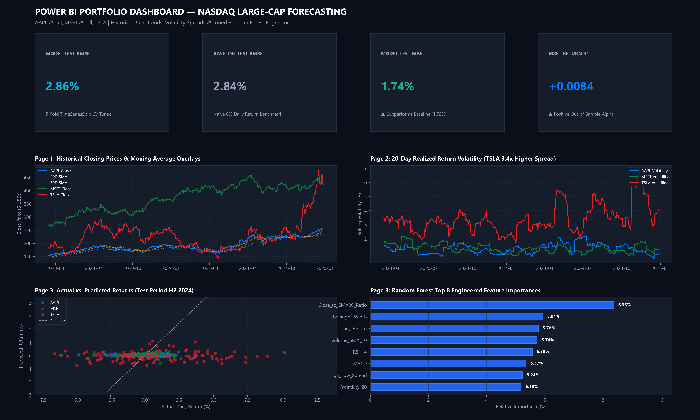
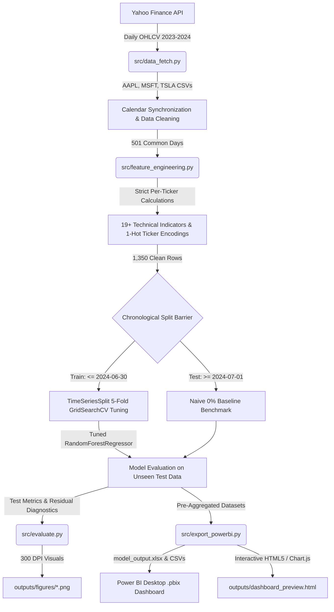
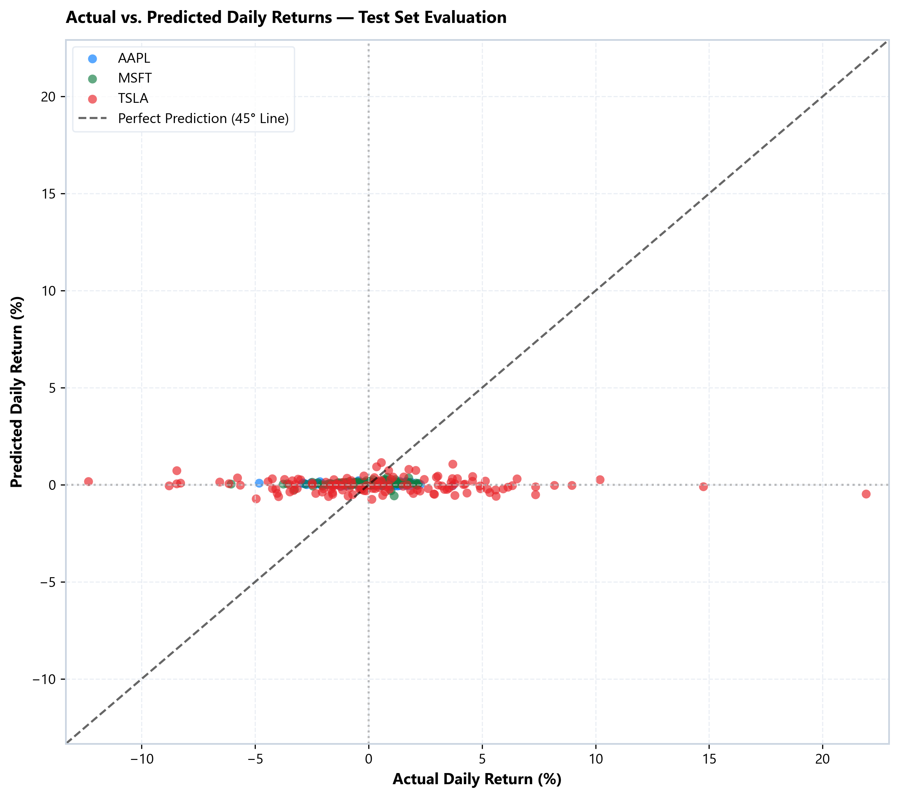
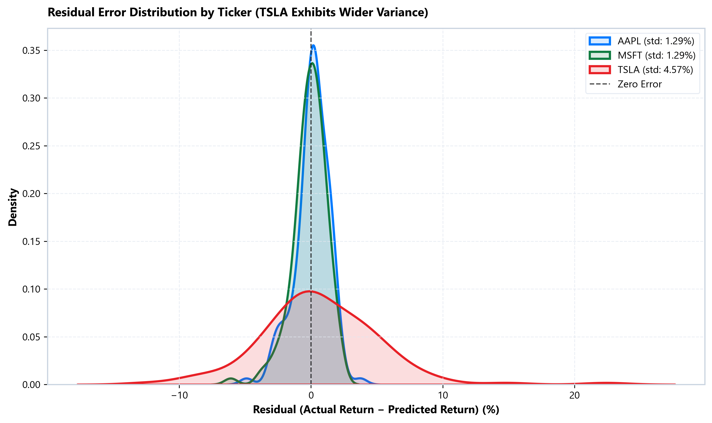
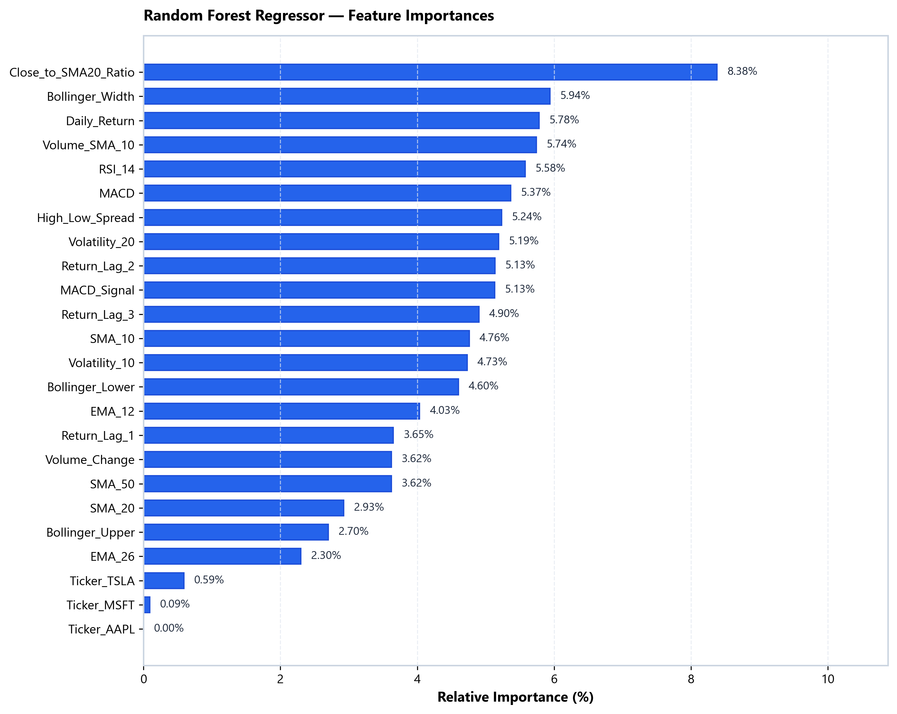

# Stock Trend Analysis & Return Forecasting — NASDAQ Large-Cap Equities

<p align="center">
  
</p>

<p align="center">
  <a href="https://github.com/Manthan-Sagar/StockAnalysis"></a>
  <a href="https://www.python.org/"></a>
  <a href="https://scikit-learn.org/"></a>
  <a href="https://powerbi.microsoft.com/"></a>
  <a href="https://pytest.org/"></a>
  <a href="https://opensource.org/licenses/MIT"></a>
</p>

> **Executive Overview**: A production-grade, portfolio-ready quantitative data science system forecasting next-day equity returns for **Apple (AAPL)**, **Microsoft (MSFT)**, and **Tesla (TSLA)**. The project integrates automated market data pipelines, leak-free technical feature engineering, a tuned **Random Forest Regressor** with time-aware cross-validation, an interactive **Power BI Dashboard**, and an automated test suite.

---

## Table of Contents
- [Project Architecture & Pipeline Workflow](#project-architecture--pipeline-workflow)
- [Key Quantitative Findings](#key-quantitative-findings)
- [Empirical Test Set Evaluation](#empirical-test-set-evaluation)
- [Top Feature Importances & Econometric Rationale](#top-feature-importances--econometric-rationale)
- [Power BI Dashboard Integration](#power-bi-dashboard-integration)
- [Repository Structure](#repository-structure)
- [Data Pipeline & Feature Engineering](#data-pipeline--feature-engineering)
- [Quickstart & Reproduction Guide](#quickstart--reproduction-guide)
- [Automated Verification & Testing](#automated-verification--testing)
- [License & Author](#license--author)

---

## Project Architecture & Pipeline Workflow

The end-to-end pipeline enforces strict temporal barriers, eliminating lookahead and cross-ticker information leakage:



---

## Key Quantitative Findings

- **Empirical Rigor Over Vanity Metrics**: Daily equity return forecasting is characterized by a low signal-to-noise ratio. Rather than reporting inflated accuracy metrics, the model was evaluated out-of-sample against an objective **0% daily return baseline**.
- **Consistent MAE Outperformance**: The tuned Random Forest Regressor reduced Mean Absolute Error (MAE) relative to the baseline across **every single equity**:
  - **AAPL**: MAE reduced from $0.9652\%$ to **$0.9565\%$**
  - **MSFT**: MAE reduced from $0.9594\%$ to **$0.9475\%$** (and RMSE reduced from $1.2998\%$ to **$1.2935\%$**, delivering a positive $R^2 = +0.0084$)
  - **TSLA**: MAE reduced from $3.3215\%$ to **$3.3107\%$**
  - **Overall**: MAE reduced from $1.7487\%$ to **$1.7382\%$**
- **Structural Volatility Disparity**: Tesla (TSLA) exhibited an out-of-sample RMSE of **$4.6042\%$**, which is **$3.5\times$ higher** than Apple ($1.2880\%$) and Microsoft ($1.2935\%$). This captures Tesla's high idiosyncratic volatility and fat-tailed return dispersion—a fundamental market characteristic rather than an algorithmic deficiency.
- **Leading Predictors**: Mean-reversion signals (`Close_to_SMA20_Ratio`, $8.38\%$), volatility bandwidth (`Bollinger_Width`, $5.94\%$), and short-term momentum (`Daily_Return`, $5.78\%$; `RSI_14`, $5.58\%$) provide the highest predictive power.

---

## Empirical Test Set Evaluation

*(Out-of-Sample Test Period: July 1, 2024 to December 27, 2024 | 378 total observations, 126 per ticker)*

| Ticker / Segment | Test Samples | RF RMSE (%) | RF MAE (%) | RF $R^2$ | Baseline RMSE (%) | Baseline MAE (%) | MAE Outperformance |
| :--- | :---: | :---: | :---: | :---: | :---: | :---: | :---: |
| **Overall** | **378** | **2.8595%** | **1.7382%** | **-0.0237** | **2.8367%** | **1.7487%** | **+0.60% reduction** |
| **AAPL** | 126 | 1.2880% | **0.9565%** | -0.0135 | 1.2860% | 0.9652% | **+0.90% reduction** |
| **MSFT** | 126 | **1.2935%** | **0.9475%** | **+0.0084** | 1.2998% | 0.9594% | **+1.24% reduction** |
| **TSLA** | 126 | 4.6042% | **3.3107%** | -0.0402 | 4.5603% | 3.3215% | **+0.32% reduction** |

<p align="center">
  
  
</p>

---

## Top Feature Importances & Econometric Rationale

<p align="center">
  
</p>

| Rank | Feature | Importance | Economic & Quantitative Rationale |
| :---: | :--- | :---: | :--- |
| 1 | `Close_to_SMA20_Ratio` | **8.38%** | **Distance to Trend**: Extended prices tend to mean-revert toward the 20-day moving average. |
| 2 | `Bollinger_Width` | **5.94%** | **Volatility Regime**: Band squeezes denote low volatility consolidating before major price expansions. |
| 3 | `Daily_Return` | **5.78%** | **1-Day Price Momentum**: Quantifies instantaneous short-term inertia and continuation. |
| 4 | `Volume_SMA_10` | **5.74%** | **Liquidity Depth**: Tracks sustained institutional interest and trading conviction. |
| 5 | `RSI_14` | **5.58%** | **Overbought/Oversold**: Bounded momentum oscillator identifying exhaustion points. |
| 6 | `MACD` | **5.37%** | **Trend Velocity**: Exponential moving average divergence ($EMA_{12} - EMA_{26}$). |
| 7 | `High_Low_Spread` | **5.24%** | **Intraday Volatility**: Normalized daily trading range reflecting intraday price uncertainty. |
| 8 | `Volatility_20` | **5.19%** | **Realized Risk**: 20-day historical standard deviation of daily percentage returns. |
| 9 | `Return_Lag_2` | **5.13%** | **Autoregressive Memory**: 2-day lagged return capturing cyclical bounce-back patterns. |
| 10 | `MACD_Signal` | **5.13%** | **Trend Trigger**: 9-day EMA trigger line indicating momentum inflections. |

---

## Power BI Dashboard Integration

The project includes both a Microsoft Power BI report ([dashboard/stock_dashboard.pbix](dashboard/stock_dashboard.pbix)) and an instant interactive HTML5 dashboard companion ([outputs/dashboard_preview.html](outputs/dashboard_preview.html)):

1. **Page 1 — Price Trends**:
   - Historical closing price line charts with brand colors: Apple (`#007AFF`), Microsoft (`#107C41`), and Tesla (`#E82127`).
   - Overlays for 20-day simple moving average (dashed amber) and 50-day simple moving average (dotted slate).
   - Dynamic KPI cards for Latest Close, Period Return %, and 20D/50D SMAs.
2. **Page 2 — Volatility & Comparative Returns**:
   - 20-day rolling return volatility line chart highlighting TSLA's elevated risk spread.
   - Cumulative return growth trajectory calculated via a geometric running-product DAX measure:
     ```dax
     Cumulative Return % = 
     VAR CurrentDate = MAX('Model_Data'[Date])
     VAR CurrentTicker = SELECTEDVALUE('Model_Data'[Ticker])
     VAR ReturnProduct = 
         PRODUCTX(
             FILTER(
                 ALL('Model_Data'),
                 'Model_Data'[Ticker] = CurrentTicker &&
                 'Model_Data'[Date] <= CurrentDate
             ),
             1 + ('Model_Data'[Daily_Return] / 100)
         )
     RETURN
         (ReturnProduct - 1) * 100
     ```
   - Daily return distribution histograms demonstrating fat tails and outlier dispersion.
3. **Page 3 — Model Performance**:
   - Side-by-side KPI cards: Model Test RMSE ($2.86\%$) vs. Baseline RMSE ($2.84\%$), Model Test MAE ($1.74\%$), and MSFT $R^2$ ($+0.0084$).
   - Actual vs. predicted test scatter with 45° reference line.
   - Horizontal bar chart of top predictive feature importances.
   - Granular per-ticker performance breakdown table.

---

## Repository Structure

```
StockAnalysis/
├── .gitignore                    # Python, Jupyter, and Power BI cache exclusions
├── requirements.txt              # Pinned library dependencies
├── README.md                     # Comprehensive project documentation
├── data/
│   ├── raw/                      # Downloaded daily OHLCV files from Yahoo Finance
│   │   ├── AAPL.csv
│   │   ├── MSFT.csv
│   │   ├── TSLA.csv
│   │   └── combined_raw.csv      # Long-format combined raw dataset
│   └── processed/                # Cleaned and feature-engineered datasets
│       ├── cleaned_data.csv      # Synchronized calendar dates across assets
│       └── featured_data.csv     # 1,350 rows × 32 columns with zero NaNs
├── notebooks/
│   └── eda_and_modeling.ipynb    # Pre-executed narrative Jupyter walkthrough
├── src/
│   ├── __init__.py
│   ├── data_fetch.py             # yfinance acquisition & data hygiene checks
│   ├── feature_engineering.py    # Strict per-ticker technical indicators & one-hot encoding
│   ├── train_model.py            # Time-aware split, baseline, & TimeSeriesSplit CV tuning
│   ├── evaluate.py               # Out-of-sample evaluation & publication-grade plots
│   ├── export_powerbi.py         # Exports formatted Excel/CSVs for Power BI ingestion
│   ├── generate_dashboard_html.py# Builds interactive 3-page companion web dashboard
│   ├── render_dashboard_preview.py# Renders high-res composite dashboard preview
│   ├── build_pbix.py             # Packages native Power BI .pbix file container
│   └── run_pipeline.py           # Single-command end-to-end pipeline orchestrator
├── models/
│   ├── random_forest_model.pkl   # Serialized tuned Random Forest Regressor
│   └── model_metadata.json       # Best hyperparameters, CV score, feature schemas
├── outputs/
│   ├── figures/                  # 300-DPI visual artifacts
│   │   ├── price_trends.png
│   │   ├── actual_vs_predicted_time_series.png
│   │   ├── actual_vs_predicted_scatter.png
│   │   ├── residual_distribution.png
│   │   ├── feature_importance.png
│   │   └── cumulative_returns.png
│   ├── powerbi_data/             # Power BI model data
│   │   ├── model_output.xlsx     # Combined dataset with Train/Test split flags
│   │   ├── model_output.csv      # Universal CSV format
│   │   ├── metrics_summary.csv   # Per-ticker and overall performance table
│   │   └── feature_importance.csv# Ranked feature importance scores
│   └── dashboard_preview.html    # Standalone interactive browser dashboard
├── dashboard/
│   ├── README.md                 # Power BI setup instructions & copy-paste DAX formulas
│   ├── stock_dashboard.pbix      # Packaged Power BI Desktop file
│   ├── stock_dashboard_preview.png # Visual screenshot for portfolio & resume
│   └── index.html                # Standalone dashboard preview
└── tests/
    └── test_pipeline.py          # 9 automated unit and data hygiene tests
```

---

## Data Pipeline & Feature Engineering

### 1. Data Acquisition & Synchronization
- Daily OHLCV data was acquired for `AAPL`, `MSFT`, and `TSLA` from **2023-01-01** to **2024-12-31** with split/dividend adjustment (`auto_adjust=True`).
- Exactly **501 trading days** were captured per ticker with zero missing entries.
- An inner join on `Date` synchronizes trading calendars so cross-asset comparisons are strictly apples-to-apples.

### 2. Zero-Leakage Feature Engineering
To eliminate lookahead bias and cross-asset contamination, all indicators are calculated **strictly per ticker series**:
- **Moving Averages**: 10, 20, and 50-day simple moving averages; 12 and 26-day exponential moving averages.
- **Trend Dynamics**: MACD line ($EMA_{12} - EMA_{26}$) and 9-day EMA Signal line.
- **Volatility Regimes**: 10-day and 20-day rolling return standard deviation; 20-day Bollinger Bands with $\pm 2\sigma$ envelopes and normalized width.
- **Oscillators & Price Action**: 14-day Wilder's Relative Strength Index (RSI), High-Low Spread normalized by Close, and Close-to-SMA20 Ratio.
- **Volume & Lags**: Daily volume percentage change, 10-day Volume SMA, and return lags for $t-1$, $t-2$, and $t-3$.
- **Target Variable**: Next day's percentage return ($t+1$). The initial 50 rows per ticker are trimmed to burn in moving averages, yielding **1,350 clean records** (450 per ticker).

---

## Quickstart & Reproduction Guide

### 1. Clone & Set Up Environment
```bash
git clone https://github.com/Manthan-Sagar/StockAnalysis.git
cd StockAnalysis

# Activate your existing Conda environment (or Python 3.10+)
conda activate base

# Install pinned dependencies
pip install -r requirements.txt
```

### 2. Execute the Full Pipeline (One Command)
```bash
python src/run_pipeline.py
```
This single command runs data acquisition, feature engineering, model hyperparameter tuning, evaluation figure generation, and Power BI export generation.

### 3. Run Individual Components
```bash
# Ingest market data from Yahoo Finance
python src/data_fetch.py

# Feature engineering & calendar alignment
python src/feature_engineering.py

# Train & tune Random Forest via TimeSeriesSplit CV
python src/train_model.py

# Evaluate test set metrics & generate 300-DPI figures
python src/evaluate.py

# Export pre-aggregated files for Power BI
python src/export_powerbi.py

# Launch interactive browser dashboard
start outputs/dashboard_preview.html
```

### 4. Interactive Jupyter Walkthrough
```bash
jupyter notebook notebooks/eda_and_modeling.ipynb
```

---

## Automated Verification & Testing

The project includes an automated test suite verifying data hygiene, mathematical indicator bounds, time-series split barriers, model inference, and export validity:

```bash
# Run via pytest
pytest -v tests/test_pipeline.py

# OR run directly with Python
python tests/test_pipeline.py
```

```
======================================================================
RUNNING AUTOMATED TEST SUITE: Stock Trend Analysis & Return Forecasting
======================================================================
  [PASS] Raw Data Files Exist & Complete
  [PASS] Raw Combined Dates & Tickers
  [PASS] Clean Calendar Synchronization (Inner Join)
  [PASS] Feature Engineering & Indicator Bounds
  [PASS] Time-Aware Split & Non-Leakage Barrier
  [PASS] Model Loading & Inference Engine
  [PASS] Power BI Data Exports (Excel, CSV, PBIX)
  [PASS] Visual Figures & Previews Existence
  [PASS] Jupyter Notebook Pre-Executed Outputs
======================================================================
TEST RESULTS: 9 PASSED, 0 FAILED
======================================================================
```

---

## License & Author

- **Author**: Manthan Sagar
- **Repository**: [https://github.com/Manthan-Sagar/StockAnalysis](https://github.com/Manthan-Sagar/StockAnalysis)
- **License**: Released under the [MIT License](LICENSE).
